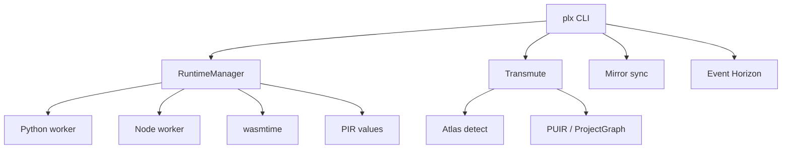

<p align="center">
  
</p>

<h1 align="center">Parallax</h1>

<p align="center">
  <strong>Polyglot migration and universal execution runtime</strong><br>
  Capture program state in one language, encode it as language-neutral IR, restore or migrate it in another.
</p>

<p align="center">
  <a href="https://github.com/theworker02/Parallax/actions/workflows/ci.yml"></a>
  <a href="LICENSE"></a>
  <a href="https://www.rust-lang.org/"></a>
  <a href="Cargo.toml"></a>
  <a href="https://parallax-runtime.github.io/parallax/"></a>
  <a href="https://github.com/theworker02/Parallax/actions/workflows/ci.yml"></a>
</p>

---

## What is Parallax?

Parallax is a Rust workspace for **honest polyglot tooling**: process-isolated Python and JavaScript workers, deterministic `.plx` snapshots, semantic-loss analysis, whole-project **Transmute** migration, continuous **Mirror** sync, **Atlas** stack detection, and **Event Horizon** for migrations that look impossible.

**Tier-1 today:** TypeScript/JavaScript → Rust project migration (`examples/weather-api`). Python ↔ JavaScript **value** migration is production-quality for bindings capture/restore. Other stacks are detected, mapped, and planned with explicit maturity — not silent fakes.

| Surface | Status |
|---|---|
| **Transmute** | TS/JS → Rust codegen path; `--require-build --require-tests` |
| **Mirror** | Linked sync + `plx sync --check` CI gate |
| **Continuum** | Same-runtime checkpoint capture (not arbitrary stack migration) |
| **Atlas** | 120+ built-in stack adapters; `plx analyze` |
| **Connectors** | 60+ language catalog; Ruby/PHP/Go workers experimental |
| **Event Horizon** | Dynamic/reflection debt; `plx impossible` |

---

## Quick start

### Prerequisites

- **Rust** 1.75+ ([rustup](https://rustup.rs/))
- **Node.js** 18+ and **Python** 3.10+ for runtime adapters
- Windows: disable Microsoft Store Python alias or install from [python.org](https://www.python.org/)

### Build

```bash
git clone https://github.com/theworker02/Parallax.git
cd parallax
cargo build -p parallax-cli --release
export PATH="$PWD/target/release:$PATH"   # optional
plx doctor
```

### Commands that show the product

```bash
# Value migration (Python ↔ JavaScript)
plx migrate examples/demo.py --to javascript -o /tmp/out.js

# Project migration (TypeScript → Rust)
plx migrate examples/weather-api --to rust -o examples/weather-api-rust --require-build --require-tests

# Stack detection
plx analyze examples/stacks/nest-prisma --to rust
plx analyze examples/weather-api --to rust

# Continuous sync
plx link examples/weather-api examples/weather-api-rust
plx sync --check

# Impossible migration analysis
plx observe examples/hostile-dynamic
plx impossible examples/hostile-dynamic --to rust
```

Global flags: `--json`, `--verbose`, `--trace`. Full reference: [CLI docs](https://parallax-runtime.github.io/parallax/cli.html).

---

## Architecture



```text
crates/                 22 Rust workspace members (Event Horizon = one crate)
├── parallax-cli        plx / parallax binaries
├── parallax-runtime    adapter orchestration + workers
├── parallax-transmute  project migration engine
├── parallax-mirror     linked sync + semantic diff
├── parallax-atlas      120+ stack adapters + analyze
├── parallax-horizon    impossible migration analysis
├── parallax-connectors 60+ language catalog
└── parallax-ir …       PIR, PUIR, UES, protocol, snapshot
adapters/               embedded Python/JS/Ruby/PHP/Go workers
docs/                   mdBook → GitHub Pages
examples/               demos, weather-api, stack fixtures
```

Deep dive: [Architecture](https://parallax-runtime.github.io/parallax/architecture.html) · [Atlas index](https://parallax-runtime.github.io/parallax/adapters/index.html) · [Transmute](https://parallax-runtime.github.io/parallax/transmute.html) · [Mirror](https://parallax-runtime.github.io/parallax/mirror.html) · [Horizon](https://parallax-runtime.github.io/parallax/horizon.html)

---

## Examples

| Path | Purpose |
|---|---|
| `examples/demo.py` / `demo.js` | Python ↔ JS value migration |
| `examples/weather-api` | Transmute + Mirror reference (TS → Rust) |
| `examples/stacks/nest-prisma` | Atlas: NestJS + Prisma detection |
| `examples/stacks/fastapi-sqlalchemy` | Atlas: FastAPI + SQLAlchemy + Ruff |
| `examples/stacks/tauri-desktop` | Atlas: Tauri desktop shell |
| `examples/hostile-dynamic` | Event Horizon dynamic/reflection fixture |
| `examples/custom-adapter` | Third-party Atlas adapter stub |

---

## Documentation

| Resource | Link |
|---|---|
| **Site** | https://parallax-runtime.github.io/parallax/ |
| **Local preview** | `cd docs && mdbook serve --open` |
| **Changelog** | [CHANGELOG.md](CHANGELOG.md) |
| **Contributing** | [CONTRIBUTING.md](CONTRIBUTING.md) |
| **Security** | [SECURITY.md](SECURITY.md) |

---

## Development

```bash
cargo fmt --all
cargo clippy --workspace --all-targets -- -D warnings
cargo test -p parallax-atlas -p parallax-horizon
cargo build -p parallax-cli
cd docs && mdbook build
```

### CI

| Workflow | Purpose |
|---|---|
| [`ci.yml`](.github/workflows/ci.yml) | fmt, clippy, cross-platform test, mdBook, stack analyze, mirror gate |
| [`pages.yml`](.github/workflows/pages.yml) | Deploy docs |
| [`release.yml`](.github/workflows/release.yml) | Release archives on `v*` tags |

---

## Status

Parallax reports **Unsupported** instead of pretending lossy or unimplemented paths succeeded. Non–Tier-1 language pairs may detect and plan but will not claim full codegen. See [Limitations](https://parallax-runtime.github.io/parallax/limitations.html).

---

## License

Licensed under the [Apache License, Version 2.0](LICENSE).

<p align="center">
  
</p>
