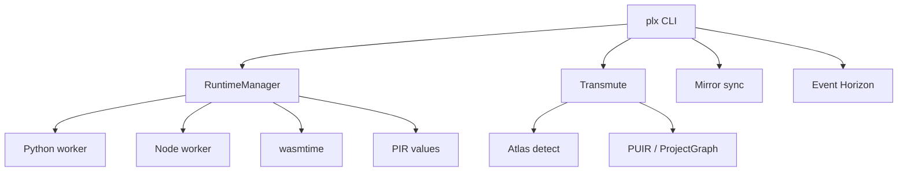

# Buyer evaluation — Value migration (Python ↔ JavaScript)

## Goal

In 15–45 minutes, verify the Product builds or runs as documented and that proprietary notices are present.

## Steps

1. Confirm root `LICENSE` is proprietary and `ACQUISITION.md` exists.
2. Skim `README.md` install/run claims.
3. Execute:

```
```bash
git clone https://github.com/theworker02/Parallax.git
cd parallax
cargo build -p parallax-cli --release
export PATH="$PWD/target/release:$PATH"   # optional
plx doctor
```
```bash
# Value migration (Python ↔ JavaScript)
plx migrate examples/demo.py --to javascript -o /tmp/out.js

# Project migration (TypeScript → Rust)
plx migrate examples/weather-api --to rust -o examples/weather-api-rust --require-build --require-tests

# Stack detection
plx analyze examples/stacks/nest-prisma --to rust
plx analyze examples/weather-api --to rust

# Continuous sync
plx link examples/weather-api examples/weather-api-rust
plx sync --check

# Impossible migration analysis
plx observe examples/hostile-dynamic
plx impossible examples/hostile-dynamic --to rust
```

```text
```

4. Run tests if present (`npm test`, `pytest`, `cargo test`, `go test ./...`, etc.).
5. Record README vs observed behavior gaps in workpapers.

## Pass criteria

- [ ] Clone succeeds
- [ ] Documented happy path works **or** failure is explained
- [ ] Minimal path needs no surprise secrets
- [ ] License notices intact

*Updated: 2026-09-22*
