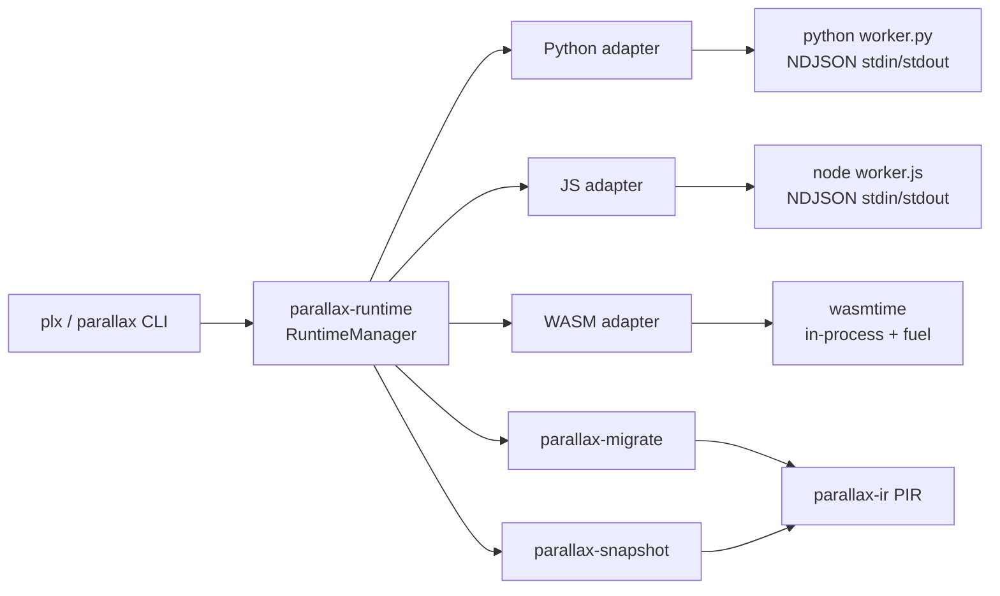
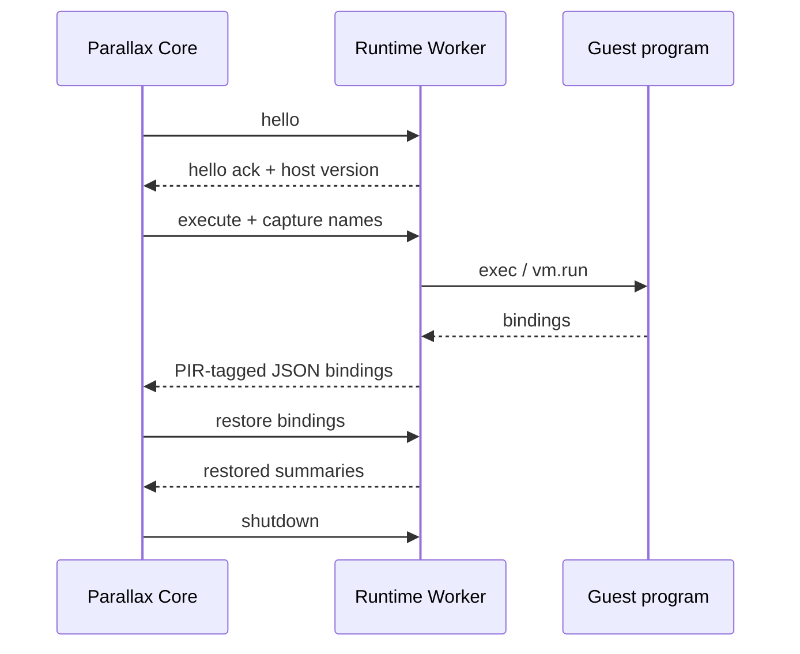
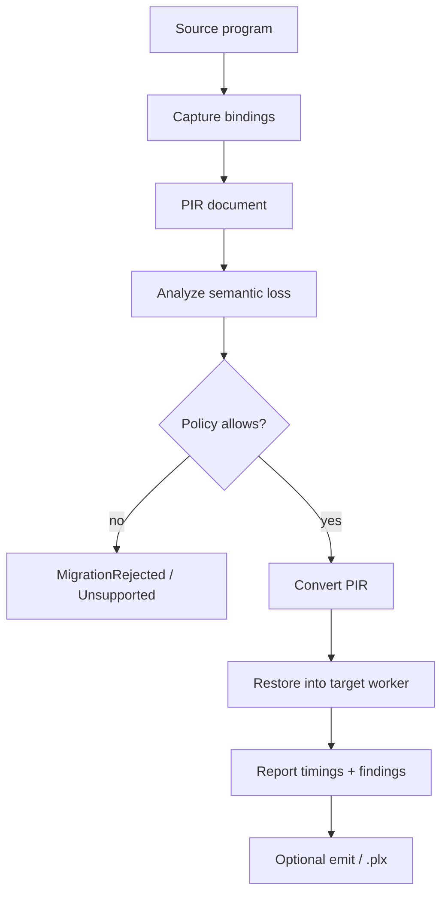

# Architecture

Parallax separates **orchestration in Rust** from **guest execution** in language-specific workers.

## System overview

## Process model

Python and JavaScript guests never share an address space with the core. WASM is the exception: it runs **in-process** via wasmtime with fuel limits.

## Crate map

The workspace ships **22 Rust crates** (Event Horizon is one crate — not a meta-workspace explosion).

| Layer | Crate | Responsibility |
|---|---|---|
| Core | `parallax-core` | Errors, IDs, capabilities, execution model, semantic-loss enums |
| IR | `parallax-ir` | PIR values, documents, hashing |
| IR | `parallax-pcir` | Continuation IR (Continuum) |
| IR | `parallax-puir` | Universal Program IR (Transmute) |
| IR | `parallax-ues` | Universal Execution State, safepoints |
| Protocol | `parallax-protocol` | Versioned NDJSON envelopes |
| Project | `parallax-project` | ProjectGraph for whole-repo migration |
| Security | `parallax-security` | Sandbox / limit policy |
| Diagnostics | `parallax-diagnostics` | Tracing helpers, doctor report types |
| Snapshot | `parallax-snapshot` | `.plx` format + integrity validation |
| Migrate | `parallax-migrate` | Analyze + convert PIR across runtimes |
| Transmute | `parallax-transmute` | Project analyze → plan → codegen → repair |
| Mirror | `parallax-mirror` | Linked sync, semantic diff, CI gates |
| Horizon | `parallax-horizon` | Impossible migration analysis (observe / debt / impossible) |
| Atlas | `parallax-adapter-sdk` | Adapter contracts, manifests, capabilities |
| Atlas | `parallax-atlas` | Registry, stack detection, `parallax.lock` |
| Connectors | `parallax-connectors` | 60+ language catalog + experimental workers |
| Runtime | `parallax-runtime` | Adapter trait, discovery, worker process, manager |
| Runtime | `parallax-adapter-python` | CPython subprocess adapter |
| Runtime | `parallax-adapter-js` | Node.js subprocess adapter |
| Runtime | `parallax-adapter-wasm` | wasmtime adapter |
| CLI | `parallax-cli` | `plx` / `parallax` binaries |

## Product layers

```mermaid
flowchart TB
  subgraph exec [Execution and value migration]
    CLI1[plx run / migrate / snapshot]
    RT[parallax-runtime]
    PIR[parallax-ir PIR]
    CLI1 --> RT --> PIR
  end
  subgraph project [Project migration]
    TM[parallax-transmute]
    AT[parallax-atlas]
    PUIR[parallax-puir]
    CLI2[plx migrate dir / analyze]
    CLI2 --> AT --> TM --> PUIR
  end
  subgraph sync [Continuous sync]
    MR[parallax-mirror]
    CLI3[plx link / sync / ci]
    CLI3 --> MR
  end
  subgraph horizon [Event Horizon]
    HZ[parallax-horizon]
    CLI4[plx impossible / observe]
    CLI4 --> HZ
  end
```

| Product surface | Primary crates | Tier-1 maturity |
|---|---|---|
| **Transmute** | transmute, puir, project, atlas | TypeScript/JS → Rust (weather-api demo) |
| **Mirror** | mirror, transmute | Linked TS ↔ Rust sync with CI gate |
| **Continuum** | ues, pcir, migrate | Same-runtime checkpoint only |
| **Atlas** | atlas, adapter-sdk | 120+ detectors; honest maturity |
| **Connectors** | connectors, runtime | 60+ languages; Ruby/PHP/Go workers experimental |
| **Event Horizon** | horizon | Dynamic/reflection debt analysis |

See [Atlas adapter index](./adapters/index.md) and [Horizon](./horizon.md).

## Migration pipeline

1. **Capture** — execute source; worker encodes named bindings as PIR JSON  
2. **Analyze** — classify loss for the target (`NONE` … `UNSUPPORTED`)  
3. **Convert** — rewrite PIR under `ConversionPolicy`  
4. **Restore** — target worker materializes values  
5. **Report** — findings + real microsecond timings  

## Concurrency

`RuntimeManager` enforces a configurable maximum concurrent adapter operations (default **4**). Excess work fails with `ResourceLimitExceeded` rather than unbounded spawn.
